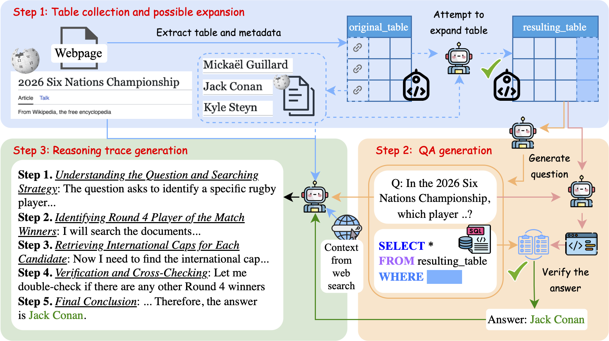

# $\pi^2$: Structure-based Reasoning Data Improves Long-Context Reasoning Ability of Large Language Models



[(https://openreview.net/forum?id=4yDpwREyhm)
[](https://arxiv.org/abs/2604.05114)
[](https://drive.google.com/drive/folders/1ISRgLijDFvwFpHzV4tmHix6MIwIGG2gd?usp=sharing)
<!-- # https://github.com/DataArcTech/LongFaith: Sample on how to use https://img.shields.io/badge -->


## Overview

We introduce $\pi^2$ (in plain text, Pi^2), a pipeline that 1) transforms Wikipedia tables and documents into high-quality complex multi-document QA data and 2) back-translates long-context reasoning traces from the context, question, and ground-truth answer.

➡️ Key takeaways:
- Fine-tuning with 1k generated reasoning traces yields consistent improvements across 4 long-context benchmarks + our new $\pi^2$-Bench (`gpt-oss-20b`: +6.3% avg gain; `Qwen3-4B-Instruct`: +3.4% avg gain)
- *Faithful reasoning patterns* discovered by back translation and reasoning traces *grounded in realistic long context* are crucial for improvement
- Self-distillation on $\pi^2$ works: `gpt-oss-20b` improves +4.4% using its own reasoning traces


## Setup environment

Run the following script to set up the conda environment and install dependencies:

```bash
source setup_venv.sh
```

We use `vLLM` to host local models.
Please refer to the [vLLM documentation](https://vllm.readthedocs.io/en/latest/) for more details on how to set up and use vLLM.
A sample command to start a local vLLM server hosting `gpt-oss-20b` is as follows:

```bash
vllm serve "unsloth/gpt-oss-20b" \
    --served-model-name gpt-oss-20b \
    --port 8000
```


## Data generation pipeline

The following script contain step-by-step commands to generate data.
There are 6 steps:

* Prepare the list of wiki pages to crawl.
* Crawl tables and metadata from Wikipedia
* Generate QAR with wiki context.
* Run web search to gather relevant realistic documents
* Post-process and merge table, QA, and web search data. Chunk the context to 96
* Generate reasoning traces.

Please visit the following bash script for more details. You can run the entire script or run each step separately.

```bash
source datasets/ours/run.sh
```


## Training data

We serve our training data via Google Drive. It is the reasoning traces data for finetuning LLMs on long-context reasoning:
- [Reasoning traces generated by gpt-oss-120b](https://drive.google.com/file/d/1hUHyNX-2qTPLxe9ennsOMRHiAdBXp5fo/view?usp=sharing)
- [Reasoning traces generated by Qwen3.5-35B-A3B](https://drive.google.com/file/d/17s_pJEFFirXi8Wywyqc4D3Nm1XhKTFIr/view?usp=sharing)

The two files are in JSONL format. Each line contains many data fields that reflect our data generation process (more elaboration later). Key data fields for finetuning on long-context reasoning are:

```python
{
    "context": "An unstructured text context retrieved from web search, containing evidences for answering the question",
    "question": "Question generated by our Pi^2 pipeline",
    "llm_generated_reasoning_traces": "Reasoning traces back-translated by the teacher LLM",
    "final_answer_sql": "Ground-truth answer"
}
```


## Bibtex

If you find our data, models, or code helpful, please consider citing our paper:

```bibtex
@inproceedings{do2026pi2,
    title={$\pi^2$: Structure-Originated Reasoning Data Improves Long-Context Reasoning Ability of Large Language Models}, 
    author={Quyet V. Do and Thinh Pham and Nguyen Nguyen and Sha Li and Pratibha Zunjare and Tu Vu},
    booktitle={Third Conference on Language Modeling},
    year={2026},
    url={https://openreview.net/forum?id=4yDpwREyhm}
}
```
